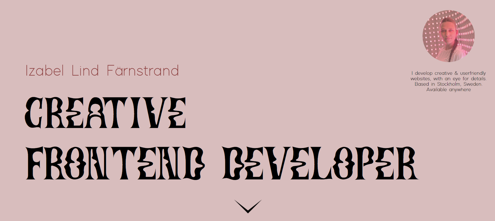

<h1 align="center">
  
</h1>

# Technigo - React Portfolio Project

As a end to spring 3 (focusing on React), we made a portfolio presenting the works we've done so far in the Bootcamp.

# Approach

I approached the project by following the design layout as closely as possible, while going a bit further away from the default design when choosing the fonts and colors. I was planning to use the API from Github, but because I missed the info on how to add images separetly I didn't understand how to do so and went with the JSON instead. When I have the time I will fix this. 

# See it live

https://izabellindfarnstrand.netlify.app/